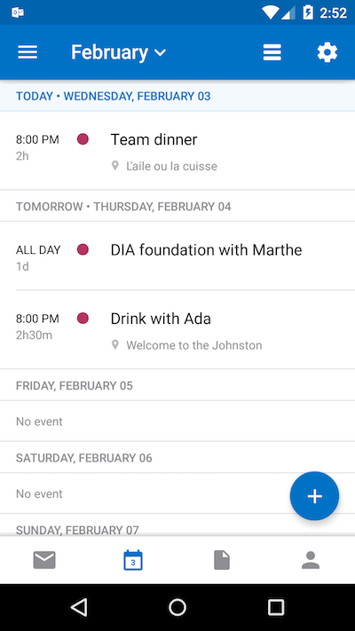
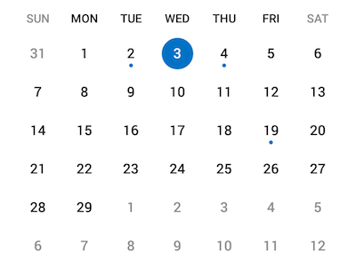
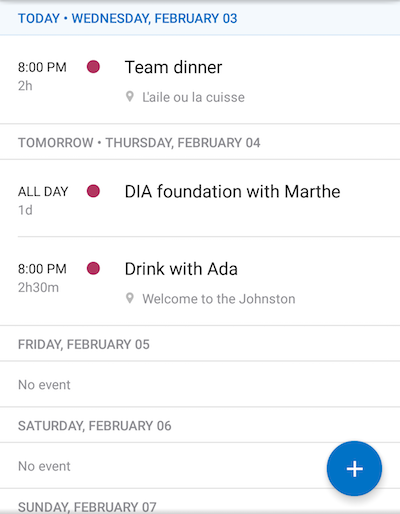
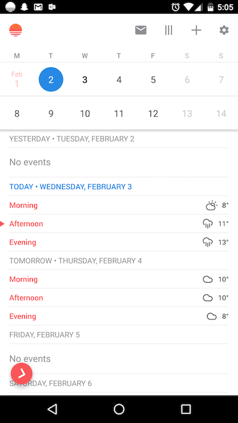

# Android Engineer Challenge

Please make your repository accessible to:

- [brsawler](https://github.com/brsawler) (brsawler@microsoft.com)
- [rno](https://github.com/rno) (arvall@microsoft.com)

**Calendar and Agenda Views**

Build an Android app that replicates the basic features described below of the Calendar and Agenda views on the [Outlook Android app](https://play.google.com/store/apps/details?id=com.microsoft.office.outlook).

It is up to you to decide which other details you'd want to implement.

Feel free to include any new features you can come up with.

## Calendar View

The calendar view is a freely scrolling view that allows the user to browse between days of the year. Tapping on a date should update the information displayed in the Agenda view.

## Agenda View

The agenda view is a freely scrolling view that allows the user to browse events in chronological order. Moving between dates should update the information displayed in the Calendar view.

## Bonus: Networking Challenge

Integrate an internet data source to retrieve the weather forecast for the user. The weather forecast is listed in the ‘Morning’, ‘Afternoon’, and ‘Evening’ cells of the Agenda view. Here are some weather data providers: [Forecast.io](https://developer.forecast.io/), [Wunderground](http://www.wunderground.com/weather/api/), and [Yahoo](https://developer.yahoo.com/weather/)
