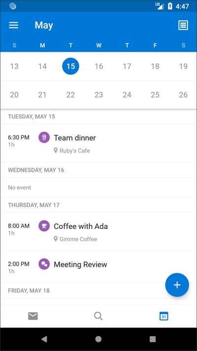
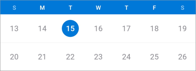
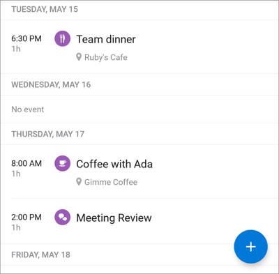

# Android Engineer Challenge

Thank you for your interest in the Outlook Mobile Android team! This project gives us a chance to see your Android programming skills.

Please complete this challenge and make your repository accessible to:

- [brsawler](https://github.com/brsawler) (brsawler@microsoft.com)
- [rno](https://github.com/rno) (arvall@microsoft.com)
- [mwyszomierski](https://github.com/mwyszomierski) (mawyszom@microsoft.com)

**Calendar and Agenda Views**

Build an Android app that replicates the basic features found in the Agenda View within the Calendar tab of the [Outlook Android app](https://play.google.com/store/apps/details?id=com.microsoft.office.outlook).

It is up to you to decide which other details you'd want to implement.

Feel free to include any new features you can come up with.

## Calendar View

The Calendar View sits above the Agenda View. It is a freely scrolling view that allows the user to browse days of the year. Tapping on a day in the calendar should update the scroll position of the Agenda view to match. The first visible day of the Agenda View determines which day is highlighted in the Calendar View.

## Agenda View

The Agenda View shows events grouped by day in chronological order. Scrolling the position of this view should update the scroll position in the Calendar View. Clicking an event brings the user to an event detail activity.

## Event Dataset

Please include a way for the user to add new events to your dataset. Events can be as simple as a title and occurrence date. Please also include a method to delete events from the dataset.

## Other Tips

- Consider how your dataset will be maintained between configuration changes and app sessions.
- Consider how long running operations (loading your backing dataset) will be implemented.
- Feel free to include any additional features.

## Bonus: Networking Challenge

Integrate an internet data source to retrieve the weather forecast for the user. This can be implemented for example by bucketing events for a day into morning / afternoon / evening sections. When weather information is available for a day, the weather can be populated in each time of day section. See the above screenshot as an example.

Here are some weather data providers: [Forecast.io](https://developer.forecast.io/), [Wunderground](http://www.wunderground.com/weather/api/), and [Yahoo](https://developer.yahoo.com/weather/)