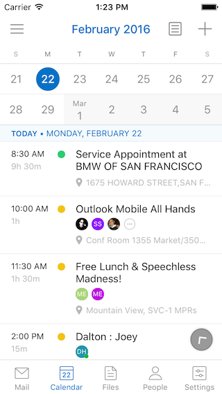
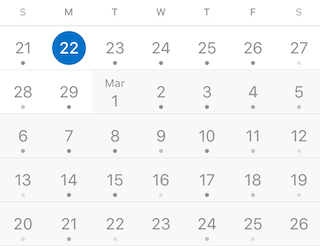
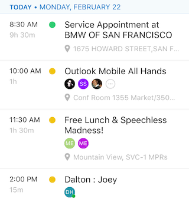

# iOS Engineer Challenge

Thank you for your interest in the Outlook Mobile iOS team! The interview process generally consists of two parts.

The first part is completing this coding challenge. This is your chance to show off your programming skills. As a result, we will rarely ask technical questions during our interviews.

The second part is one or two interviews over the phone or on site. These interviews are pretty casual and focus on making sure we will be a good fit.

Please complete this challenge and send a zip copy to:

- Ogden Kent (email: ogkent@microsoft.com, github: ogkent, bitbucket: ogkent)
- Eddie Kim (email: edki@microsoft.com, github: eddiekim, bitbucket: eddie-kim)

## Requirements

- Please avoid using 3rd-party libraries: we want to see your code and problem solving. We do not expect you to handle all cases (calendar is complicated), so don't be afraid to cut some features if you need to. A comment explaining what you didn't have time to implement, and some of your thoughts, is always appreciated.
- Please minimize your use of xibs/storyboards: we're interested to see how you organize your view hierarchy, lay out your views, and structure your project. We find an overreliance on xibs and storyboards often hides this.

## Calendar and Agenda Views

Build an iOS app that replicates the basic features described below of the Calendar and Agenda views on the [Outlook iOS (iPhone) app](https://itunes.apple.com/us/app/microsoft-outlook-email-calendar/id951937596?mt=8).

We've highlighted the primary features of each of these views below. You can decide which other details to implement and any new features you can come up with. We don't expect an exact copy so show us your creativity.

We really want to see your best work. Take as little or as long as you need to. We understand how busy life can be.

### Calendar View

The Calendar view is a continuously scrolling view that allows the user to browse between days of the year. Tapping on a date should update the information displayed in the Agenda view.

### Agenda View

The Agenda view is a continuously scrolling view that allows the user to browse events in chronological order. Moving between dates should update the information displayed in the Calendar view.

### Other Tips

- Make sure the expansion and contraction interaction between the Calendar view and Agenda view is fast and fluid

- Feel free to cut out non-essential features if you are short on time

- Use a static data set for your calendar events

## Bonus: Networking Challenge

Integrate an internet data source to retrieve the weather forecast for the user's device location. Display that information wherever you think makes the most sense.

Here are some weather data providers: [Forecast.io](https://developer.forecast.io/), [Wunderground](http://www.wunderground.com/weather/api/), and [Yahoo](https://developer.yahoo.com/weather/)
